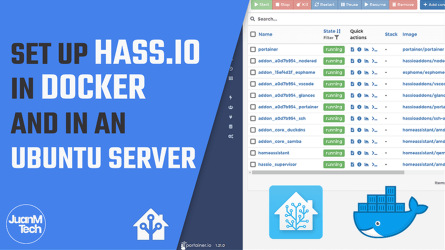

# Home Assistant Configuration 
### This is my Home Assistant Configuration and i'm not that great at README's
# Installation
 I run Hass.io in a ESXi VM running Ubuntu Server

## JuanMTech recently made this guide showing how to install Hass.io on Ubuntu Server:
